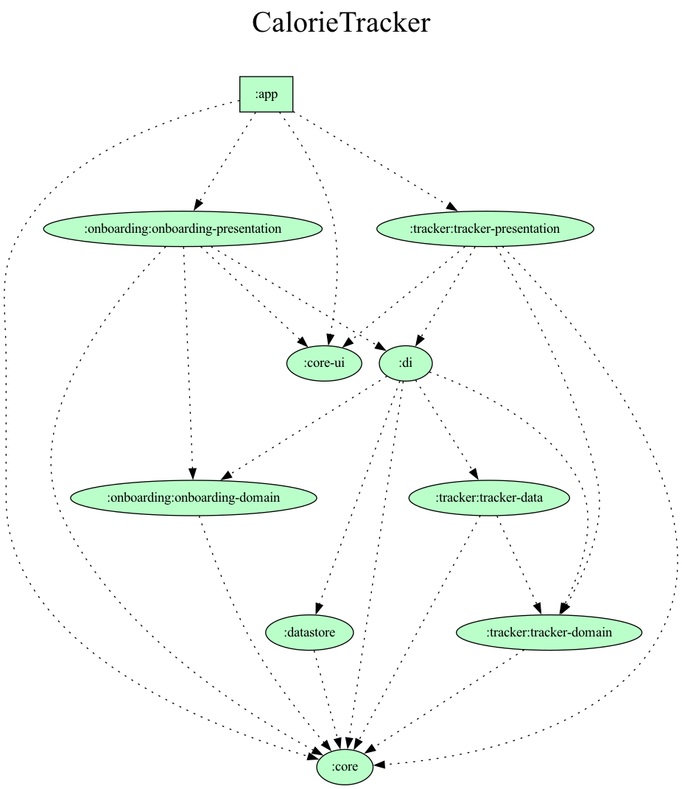

# CalorieTracker
**CalorieTracker** is a simple calorieTracking 🍽️ Android application built to describe the use of Modern Android development tools.

## Built With 🛠
- [Kotlin](https://kotlinlang.org/) - First class and official programming language for Android development.
- [Coroutines](https://kotlinlang.org/docs/reference/coroutines-overview.html) - For asynchronous and more..
- [Dagger-Hilt](https://dagger.dev/hilt/) - Hilt provides a standard way to incorporate Dagger dependency injection into an Android application.
- [Android Architecture Components](https://developer.android.com/topic/libraries/architecture) - Collection of libraries that help you design robust, testable, and maintainable apps.
    - [Stateflow](https://developer.android.com/kotlin/flow/stateflow-and-sharedflow) - StateFlow is a state-holder observable flow that emits the current and new state updates to its collectors.
    - [Flow](https://kotlinlang.org/docs/reference/coroutines/flow.html) - A flow is an asynchronous version of a Sequence, a type of collection whose values are lazily produced.
    - [ViewModel](https://developer.android.com/topic/libraries/architecture/viewmodel) - Stores UI-related data that isn't destroyed on UI changes.
    - [Room](https://developer.android.com/topic/libraries/architecture/room) - SQLite object mapping library.
    - [Jetpack Navigation](https://developer.android.com/guide/navigation) - Navigation refers to the interactions that allow users to navigate across, into, and back out from the different pieces of content within your app
    - [DataStore](https://developer.android.com/topic/libraries/architecture/datastore) - Jetpack DataStore is a data storage solution that allows you to store key-value pairs or typed objects with protocol buffers. DataStore uses Kotlin coroutines and Flow to store data asynchronously, consistently, and transactionally.
- [Material3](https://m3.material.io/) - Material Design UI components.

## Project Dependencies Graph

